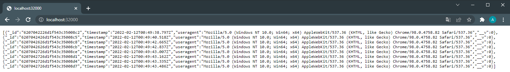

> This guide assumes you already know javascript.
> You can find all the code used throughout this guide [here](https://github.com/alesancor1/Blog-Projects/tree/main/guides/simple-app)
## Requirements

In order to perform a full deployment of a simple Node App, we need to first meet the following requirements:

1. Install [NodeJS and npm](https://nodejs.org/es/download/).
2. Install [Docker](https://docs.docker.com/engine/install/) and [Docker Compose](https://docs.docker.com/compose/install/).
3. Any SCE or IDE (We will be using VSCode for this guide)
4. Git (Not actually needed, but always recommended)

> Windows users may be interested in installing [Docker Desktop](https://www.docker.com/get-started) since Compose comes already integrated along a single node Kubernetes Cluster


## First steps

Every NodeJS always app starts with a **package.json** file. This file provides basic information and metadata about the project, it is also where dependencies and scripts are defined. The entrypoint to our npm package is defined in the *main* field of package.json, this way, runing ```npm start``` will start the app asi if we ran ```node index```

> Many npm packages, such as *prettier*, *snyk*, *mocha* or *nyc* use the package.json file as a mean to override default configuration. This transform package.json into an important configuration file for many dependencies.

In order to create our first node app, we can simply run ```npm init```. This command will prompt some fields that we need to fill for our package.json to generate. When generated, a file named **package-lock.json** will be created, too. Lock files contains the full dependency tree of all packages. Many developers tend to avoid uploading this file to SVNs, it is actually a really good practice to do so, since we ensure everyone cloning or forking our repository will be using the same dependencies.

We have now generated the basic files in order to start a new NodeJS app or npm package. Now it is time to install some dependencies before start coding.

## Installing dependencies

Node comes along with npm, a really powerful package manager that allow developers to download and install libraries that serve as dependencies for other developers' projects. The purpose of this guide is to create a NodeJS application that is able to connect to MongoDB and allow making REST requests to an ExpressJS server. 

Neither of that is natively supported in Node, so here is where npm comes. We will install [ExpressJS](https://www.npmjs.com/package/express) and [mongoose](https://www.npmjs.com/package/mongoose) through npm for our app to be able to receive clients requests and connect to MongoDB. To install them, run:

    npm install express mongoose

> You may also find this command along **--save** and **--save-dev** options. --save option is no longer required since by default npm will write the dependencies to the *dependencies* field of package.json, meaning this packages are **core dependencies** and must be installed for your code to work. On the other hand, --save-dev option tells npm to write the packages to *dev_dependencies*, meaning that those package are only used for development and therefore not required in production environments.
>
> Some packages typically installed under *dev_dependencies* are: Mocha, Nyc, Prettier, EsLint, Snyk... 

Once npm has installed the dependencies, we can start coding by creating a new file named **index.js**. This file will be the entrypoint of our app, and will be the first file that will be executed when the app is started.

## Coding the app

### Requiring Dependencies
First thing we need to do before start writing code, is to require those dependencies we will need for our purpose. As we said before, this app is meant to connect to mongoDB and expose its data through an ExpressJS server, so we will need to import the ExpressJS and Mongoose libraries. There are two popular ways of importing dependencies depending on the specification our package follows. 

The standard way of importing dependencies has always been to use the ```require``` function. This standard is known as **CommonJS** and is the most widely used by NodeJS developers. However, since the release of Node 12 (LTS), **ECMA Script**, also known as **ES Modules (ESM)** has been gaining wide support and popularity. ES Modules use the ```import``` syntax, which allows to load modules synchronously and asynchronously with a more readable syntax.

>Since CommonJS is the most popular for now, we will be using this specification for our simple project. A future post will describe in depth the pros and cons of both specifications when it comes to NodeJS development.

That being said, we can now import our packages using the **require** function:

```javascript
// Index.js
const express = require('express')
const mongoose = require('mongoose')
```
### Environment Variables
In order to connect to MongoDB, it is a good practice to define environment variables. This way, we can change the host and port of MongoDB without having to change the code. 

> **tip:** Hard-coding some values in the code may lead to critical security issues, hard maintenance and potential bugs. Always try to make your code as easy to maintain as possible. Sensitive data like passwords or tokens **MUST NEVER** be present in the code.

We will be declaring environment variables for the configuration needed to connect to the database, apart from the port in which our app will be running:

```javascript
// Index.js
const port = process.env.PORT || 32000
const mongoHost = process.env.DB_HOST || "localhost";
const mongoPort = process.env.DB_PORT || "27017";
const mongoDBName = process.env.DB_NAME || 'simple-db';
```

Note that we are using the **OR operator** ' || ' to define default values for the environment variables, this will allow us to run the app locally without having to specify the values for the environment variables.

### Writting a mongoose model
For storing data in our database, we first need to provide a **Schema** that defines how this data is actually structured. This Schema will be used to create a Mongoose model. We are going to create a 'Log' model, consisting on the **timestamp** and the **user-agent** of the client request.

Create a new file named **Log.js** under a directory named **models**:

```javascript
// Log.js
const mongoose = require('mongoose');
const Schema = mongoose.Schema;

const LogSchema = new Schema(
  {
    timestamp: {
      type: Date,
      required: true
    },
    useragent: {
      type: String,
      required: true
    }
  }
);

module.exports = mongoose.model('Log', LogSchema);
```

Don't forget to export the model so that we can use it in other files.

### Creating and configuring Express server
Creating a express server is as simple as creating a new instance of the ExpressJS class. We will declare a new constant named **app** and assign it to the new ExpressJS instance:

```javascript
// Index.js
const app = express()
```

With the ExpressJS instance created, we can now start configuring our app. First thing we will do is configure an endpoint that receives GET requests to the root of our app. This endpoint will store the timestamp and the user-agent of the client request in the database and will return all the stored logs right after.

```javascript
app.get('/', (req, res) => {
    let newLog = new Log({
        timestamp: new Date(),
        useragent: req.get('User-Agent') || 'Unknown'
    })
    newLog.save().then(() => {
        Log.find({}).exec().then(logs => res.send(logs)).catch(() => res.status(500).send('Server error'))
    }).catch(err => {
        console.log(err)
        res.status(500).send('Unknown error')
    })
})
```

> Express and mongoose functions are asyncronous and therefore return **promises**. We can use the **then** function to handle the success case and the **catch** function to handle the error case. You will find more about promises in future posts.

### Connecting to Mongo and starting the server
Once created our database model and configured the endpoints for the express server, it is time to connect and start listening to a port. Since this app fully relies on MongoDB to work, we will code this in a way to force mongoose to connect before starting the server. We can easily do that thanks to **then** function of promises.

```javascript
const mongoURL = `mongodb://${mongoHost}:${mongoPort}/${mongoDBName}`;

mongoose.connect(mongoURL).then( resp => {
    app.listen(port, () => {
        console.log(`Connected! Simple app listening on port ${port}`)
    })
}).catch(() => console.log("Could not connect to db"))
```

Don't forget to handle possible connection errors or Node process will prompt a hardly readable message.

## Running the app locally
Thanks to default values declared for the environment variables, we just need to set up a MongoDB instance and run ```npm start``` to start the app. You can easily deploy a mongo container with docker:

    docker run --name mongo -p 27017:27017 -d mongo:latest 

If you performed all the steps correctly, you should be able to access the app at http://localhost:32000/ in your browser. You will see a log each time you reload the page:



## Dockerizing and pushing the image
It is a common practice to dockerize the app into an image and push it to a registry before moving to a production environment. Running a docker container in production avoids the need to install the required infrastructure and configuration (NodeJS, npm, mongoDB, etc.) in the remote machine and allows the app to scale dinamically if configured correctly.

> Applications based on the microservices architecture are usually deployed in clusters (e.g kubernetes) which relies on Docker containers.

The first step is to create a **Dockerfile** in the root of the project. This Dockerfile will be used to build the image, commonly from another image (NodeJS official image for this example). We indicate the steps needed to run our app following the [Dockerfile reference](https://docs.docker.com/engine/reference/builder/), the result is shown below:

```dockerfile
# Dockerfile
FROM node:16.13.0-alpine3.14

COPY . .

RUN npm install --only=prod

ARG NODE_ENV=production
ENV NODE_ENV $NODE_ENV

CMD [ "node", "index.js" ]
```

Once the Dockerfile is ready, we can build our image by running the **docker build** command. We will use the **-t** flag to specify the name of the image we want to build.

    docker build -t alesancor1/simple-app .

> If you are planning to upload the image to **DockerHub**, you need to specify the tag following the <username>/<app-name> format.

Now the image is created and stored in our local machine, for pushing it to DockerHub, we will need to login to DockerHub. To do this, we will use the **docker login** command.

    docker login -u <username> --password-stdin

> It is reccommended to use --password-stdin options to avoid typing the password in the command line without any tipe of encryption.

Finally, we can push our docker image to docker hub and indicate a version tag for our app. In this case, I specify the 'latest' version tag.

    docker push alesancor1/simple-app:latest

## Conclusion
This is the end of the guide. If you want to learn more about deploying applications in production environment, check out the [Kubernetes post](http://alesancor1.github.io/kubernetes-fundamentals) and [Helm post](http://alesancor1.github.io/helm-fundamentals) to learn more about the different tools and techniques used to deploy applications in production.