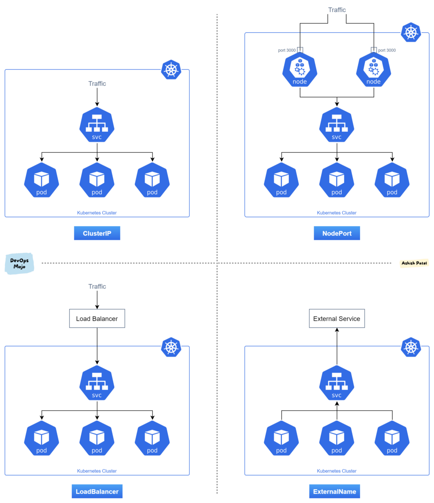

<style>
    table {
        border-collapse: collapse;
        width: 100%;
    }
    td, th {
        border: 1px solid #dddddd;
        padding: 8px;
    }
    th {
        text-align: center;
        background-color: #dddddd;
    }
    tr:nth-child(even) {
        background-color: #ffffff;
    }
    tr:nth-child(odd) {
        background-color: #efefef;
    }
    summary {
        cursor: pointer;
    }
</style>

## Introduction
Kubernetes (commonly abbreviated as k8s) is a **container orchestration** system that is designed to be easy to use and easy to deploy. As the "container orchestation" term suggests, Kubernetes relies on containers and offers an administration environment that focus on them. According to their docs:

> Kubernetes is a portable and extensible open source platform for managing workloads and services. Kubernetes facilitates automation and declarative configuration. It has a large and rapidly growing ecosystem. Support, tools and services for Kubernetes are widely available.

Summing up, kubernetes offers a fully equiped administration environment for running multiple containers, which makes it the favourite choice when it comes to deploying microservices inside a **cluster**.

### Clusters

A Cluster is a set of **nodes** that run containerized applications. Kubernetes clusters allow containers to run across multiple machines and environments: virtual, physical, cloud-based, and on-premises. Kubernetes containers are not restricted to a specific operating system, unlike virtual machines. Instead, they are able to share operating systems and run anywhere.


Clusters consists on a **master node** and a number of **worker nodes**. Nodes are independent machines with a number of cores and memory each which can run multiple containers. The master node controls the state of the cluster and is the origin of all task assignments, coordinating processses such as scheduling and scaling applications, maintaining the cluster state or implementeing updates.

Worker nodes, on the other hand, are the nodes that perform the master's assignments. They operate as part of one system, orchestated by the master. Worker noeds can be virtual or physical machines.

### Single Node Clusters

Single node clusters are a popular solution for testing and development purposes. Since they consists on a single node, they are able to run in local machines where developers can work on their applications' development.

Most used single node clusters are [Minikube](https://minikube.sigs.k8s.io/docs/start/) and [Docker Kubernetes](https://docs.docker.com/desktop/kubernetes/). The last one comes installed with Docker Desktop so you only need to activate kubernetes from the settings.

### Kubernetes Cluster Structure
A Kubernetes cluster contains six main components:

1. **API server:** Exposes a REST interface to all Kubernetes resources. Serves as the front end of the Kubernetes control plane.
2. **Scheduler:** Places containers according to resource requirements and metrics. Makes note of Pods with no assigned node, and selects nodes for them to run on.
3. **Controller manager:** Runs controller processes and reconciles the cluster’s actual state with its desired specifications. Manages controllers such as node controllers, endpoints controllers and replication controllers.
4. **Kubelet:** Ensures that containers are running in a Pod by interacting with the Docker engine , the default program for creating and managing containers. Takes a set of provided PodSpecs and ensures that their corresponding containers are fully operational.
5. **Kube-proxy:** Manages network connectivity and maintains network rules across nodes. Implements the Kubernetes Service concept across every node in a given cluster.
6. **Etcd:** Stores all cluster data. Consistent and highly available Kubernetes backing store. 


These six components can each run on Linux or as Docker containers (This is the case of Docker desktop kubernetes). The master node runs the **Control Plane** (API server, scheduler and controller manager), and the worker nodes run the kubelet and kube-proxy.

> kubernetes also provides an internal **DNS server** for registering services domain names, it is automatically included in the DNS requests made from the containers.

## CLI commands

> This section does not cover the complete Kubernetes CLI documentation. Think of it as a quick reference cheat sheet for basic commands when managing your cluster. You can find the complete documentation [here](https://kubernetes.io/docs/reference/generated/kubectl/kubectl-commands).

### Basic commands

- **Kubectl create**:

    Create a resource from a file or from stdin.

        $ kubectl create RESOURCE NAME [...PROPERTIES]

    > You can run ```kubectl api-resources``` to see the different resources available. Check the [Resources](#resources) sections for more information

- **Kubectl get**
    
    Display one or many resources.

        $ kubectl get [(-o|--output=)json|yaml|name|go-template|go-template-file|template|templatefile|jsonpath|jsonpath-as-json|jsonpath-file|custom-columns-file|custom-columns|wide] (TYPE[.VERSION][.GROUP] [NAME | -l label] | TYPE[.VERSION][.GROUP]/NAME ...) [flags]
    

    | **Option**  	| **Shortcut** 	| **Description**                             	| **Exampe**                                 	|
    |-------------	|:------------:	|---------------------------------------------	|--------------------------------------------	|
    | --namespace 	|      -n      	| Specify the namespace to get resources from 	| ```Kubectl get pods --namespace=example``` 	|
    | --output    	|      -o      	| Output format                               	| ```Kubectl get deployments -o json```      	|
<br>

- **Kubectl describe**

    Show details of a specific resource. Print a detailed description of the selected resources, including related resources such as events or controllers. You may select a single object by name, all objects of that type, provide a name prefix, or label selector.

        $ kubectl describe RESOURCE NAME
    
    | **Option**  	| **Shortcut** 	| **Description**                             	| **Exampe**                                 	    |
    |-------------	|:------------:	|---------------------------------------------	|------------------------------------------------   |
    | --namespace 	|      -n      	| Specify the namespace to <br>get resources from 	| ```Kubectl describe pods --namespace=example``` 	|
<br>

- **Kubectl delete**

    Delete resources by file names, stdin, resources and names, or by resources and label selector.

        $ kubectl delete ([-f FILENAME] | [-k DIRECTORY] | TYPE [(NAME | -l label | --all)])

    | **Option**  	| **Shortcut** 	| **Description**                             	| **Exampe**                                 	    |
    |-------------	|:------------:	|---------------------------------------------	|------------------------------------------------   |
    | --namespace 	|      -n      	| Specify the namespace <br>to get resources from 	| ```Kubectl delete pods example --namespace=example``` 	|
    | --force    	|           	| Forces the deletion of the resource          	| ```Kubectl delete pods example --force``` 	|
    | --selector 	|      -l      	| Label query to filter on                  	| ```Kubectl delete pods --l key=value``` 	|
    
    > Deleting a namespace will also delete all objects in that namespace.


### App management

- **Kubectl apply**
    
    Apply a configuration to a resource by file (manifest) name or stdin. The resource name must be specified. This resource will be created if it doesn't exist yet.

        $ kubectl apply (-f FILENAME | -k DIRECTORY)

    > Check the [Manifests](#manifests) section to see the structure of the files.

- **Kubectl scale**

    Set a new size for a deployment, replica set, replication controller, or stateful set.

        $ kubectl scale [--resource-version=version] [--current-replicas=count] --replicas=COUNT (-f FILENAME | TYPE NAME)

### Working with apps

- **Kubectl exec**

    Execute a command in a container.

        $ kubectl exec (POD | TYPE/NAME) [-c CONTAINER] [flags] -- COMMAND [args...]
    
    | **Option**  	| **Shortcut** 	| **Description**                             	| **Exampe**                                 	    |
    |-------------	|:------------:	|---------------------------------------------	|------------------------------------------------   |
    | --container 	|      -c      	| Container name                             	| ```kubectl exec example -c cname -- echo "hi"``` 	|
    | --stdin    	|      -i    	| Pass stdin to the container                 	| ```Kubectl exec -i example -- echo "hi"```       	|
    | --tty        	|      -l      	| Stdin is a TTY                              	| ```Kubectl exec -t example -- echo "hi"``` 	|
    
    > Just like in docker, you can use -i & -t (-it) flags to launch an interactive shell inside the container.

- **Kubectl logs**

    Print the logs for a container in a pod or specified resource. If the pod has only one container, the container name is optional.

        $ kubectl logs [-f] [-p] (POD | TYPE/NAME) [-c CONTAINER]

    | **Option**  	| **Shortcut** 	| **Description**                             	| **Exampe**                                 	    |
    |-------------	|:------------:	|---------------------------------------------	|------------------------------------------------   |
    | --container 	|      -c      	| Prints a container log                        | ```kubectl logs example -c cname``` 	            |
    | --follow    	|      -f    	| Real time logs                             	| ```kubectl logs -f example ```       	            |
    | --tail        |            	| Print last X logs (default -1)               	| ```Kubectl logs --tail 100 example``` 	        |
    


## Resources

Every application running inside a kubernetes cluster is deployed by creating a set of resources that interact with each other and make the application accesible to the outside world.

Those resources can be of many **types**, each one performs a specific task inside the cluster. They can be created declaratively through **manifests** files. There is not a certain number of resources, since they are retrieved from the Kubernetes API, which is extensible. However, Kubernetes natively provides a set of resources that are pre-defined in the endpoints of Kubernetes API, check the [Kubernetes API](#kubernetes-api) section containing some of the most commonly used.

> A resource is an endpoint in the **Kubernetes API** that stores a collection of API objects of a certain kind; for example, the built-in pods resource contains a collection of Pod objects.

### Manifests
Manifests are files that describes the **properties** of a certain resource type. They can be written in **YAML** or **JSON** format, and vary depending on the resource type. Since many applications require multiple resources to be created, their properties can be simplified by writting the resources in the same file separated by ```---``` lines. The following example shows how to deploy an nginx container in a pod with a LoadBalancer service to allow connections fron outside the cluster:

```yaml
apiVersion: v1
kind: Service
metadata:
  name: my-nginx-svc
  labels:
    app: nginx
spec:
  type: LoadBalancer
  ports:
  - port: 80
  selector:
    app: nginx
---
apiVersion: apps/v1
kind: Deployment
metadata:
  name: my-nginx
  labels:
    app: nginx
spec:
  replicas: 3
  selector:
    matchLabels:
      app: nginx
  template:
    metadata:
      labels:
        app: nginx
    spec:
      containers:
      - name: nginx
        image: nginx:1.14.2
        ports:
        - containerPort: 80
```
Resources can be created through manifests using `kubectl apply -f <manifest>` command.

> It is a recommended practice to put resources related to the same microservice or application tier into the same file, and to group all of the files associated with your application in the same directory. If the tiers of your application bind to each other using DNS, you can deploy all of the components of your stack together
### Kubernetes API
The kubernetes API provides a set of endpoints that allow you to interact with the resources in the cluster. The API is extensible, and new resources can be added to it. The following resources comes pre-defined in the Kubernetes API and are the most commonly used for any application deployment:

<details>
<summary><b>&emsp;Pods</b></summary><div style="padding-left: 30px"> 

A pod is a collection of containers that are deployed on a node, it may be composed of only one container, or many directly connected containers in some advanced scenarios. Pods run inside a node of the cluster and most of the time are dynamically created by deployments.


The following manifest file describes a pod that contains a single container running nginx:

```yaml
apiVersion: v1
kind: Pod
metadata:
  name: static-web
spec:
  containers:
    - name: web
      image: nginx
      ports:
        - name: web
          containerPort: 80
          protocol: TCP
```

> Note that the apiVersion field indicates "v1". The apiVersion depends on the type of resource, run `kubectl api-resources` to see the list of available resources and their api group.
</div>
</details>

<!-- ============================================================== -->

<details>
<summary><b>&emsp;ReplicaSet</b></summary><div style="padding-left: 30px"> 

The ReplicaSet manage a number of Pods and guarantees that a specified number of Pods are running at any given time. Despite being a step further than pods, ReplicaSets are not meant to be used directly, just like pods, since deployments are a higher level solution capable of manage ReplicaSets.

```yaml
apiVersion: apps/v1
kind: ReplicaSet
metadata:
  name: example
spec:
  replicas: 3
  selector:
    matchLabels:
      tier: example
  template:
    metadata:
      labels:
        tier: example
    spec:
      containers:
      - name: example
        image: example/example
```
> Note that ReplicaSet manifests are really similar to Pods'. They both include specs for the containers to be deployed, but ReplicaSets additionally includes a field for the replicas that will be created, and a selector to match other pods that could be managed.

</div></details>

<!-- ============================================================== -->

<details>
<summary><b>&emsp;Deployments</b></summary><div style="padding-left: 30px"> 

The deployment resource manage Pods and ReplicaSets by providing declarative updates. It is a higher level resource than ReplicaSets, since it is able to manage them. ReplicaSet should not be managed directly, instead they are managed through the Deployment resource. Typical use cases for deployments include deploying ReplicaSets, declaring new state for Pods, roll back to previous state, horizontal scaling, etc.

> Deployments manifests file are the same as ReplicaSet manifests, but specifying the kind Deployment instead of ReplicaSet.
</div></details>

<!-- ============================================================== -->

<details>
<summary><b>&emsp;Namespaces</b></summary><div style="padding-left: 30px"> 

Namespaces are used to organize resources in the cluster. They segregate resources into different namespaces, and provide isolation between different applications. Once a namespace is created, it can be used under the `metadata.namespace` field of those resources which are namespaced (see [kubernetes api-resources](https://kubernetes.io/docs/reference/kubectl/overview/#resource-types)).

In order to create a new namespace, run:
```bash
$ kubectl create namespace <namespace>
```

> When executing kubectl commands on namespaced resources, remember to add the `-n` flag to specify the namespace. All namespaced resources are removed when the namespace is deleted.
</div></details>

<!-- ============================================================== -->

<details>
<summary><b>&emsp;Services</b></summary><div style="padding-left: 30px"> 

Services describe how an application (a set of pods) is accessed, and how it is exposed to the outside world. Services can expose ports and even provide a load balancer. This way, service discovery is automatically provided by kubernetes, giving the pods its own IP address and a DNS name.

Since pods are being destroyed and redeployed, there is no way to know which IP address each pod has at the time. That is why we use services.

> In Kubernetes, a Service is an abstraction which defines a logical set of Pods and a policy by which to access them (sometimes this pattern is called a micro-service). The set of Pods targeted by a Service is usually determined by a selector.

A serice can be defined through this manifest file:

```yaml
apiVersion: v1
kind: Service
metadata:
  name: my-service
spec:
  type: {{ ClusterIP | NodePort | LoadBalancer | ExternalName }}
  selector:
    app: MyApp
  ports:
    - name: http
      protocol: TCP
      port: 80
      targetPort: 1234
      nodePort: 30000 # If type == NodePort
```

Depending on the type of service, the service can perform different tasks inside the cluster:

- **ClusterIP:** Exposes the Service on a cluster-internal IP. Choosing this value makes the Service only reachable from within the cluster. This is the default *ServiceType*.

- **NodePort:** Exposes the Service on each Node's IP at a static port (the NodePort). A ClusterIP Service, to which the NodePort Service routes, is automatically created. You'll be able to contact the NodePort Service, from outside the cluster, by requesting `<NodeIP>:<NodePort>`.

- **LoadBalancer:** Exposes the Service externally using a cloud provider's load balancer. NodePort and ClusterIP Services, to which the external load balancer routes, are automatically created.

- **ExternalName:** *(Needs Kube-dns >= 1.7 or CoreDNS >= 0.0.8)* Maps the Service to the contents of the externalName field (e.g. foo.bar.example.com), by returning a CNAME record with its value. No proxying of any kind is set up.

> Kubernetes by default restricts nodePort port range to 30000-32767. This behaviour can be configured by setting the `--service-node-port-range` flag in the kubeapi-server.yaml file. In case you run a cluster locally with Docker, check [this site](https://stackoverflow.com/questions/64758012/location-of-kubernetes-config-directory-with-docker-desktop-on-windows) to find where the kubeapi-server.yaml file is located.

When declaring a service, we should know what ports are we going to use to connect our application to the service. That's why is important to know the differences between `port`, `targetPort` and `nodePort` fields.

- **Port:** Cluster port to which the service will be listening.
- **TargetPort:** Port where the application inside a container is actually running.
- **NodePort:** Port Mapping to be exposed outside the cluster.

> **Example:** If we hace an app running on port 8080 on the container, and we specify Port = 8085, TargetPort = 8080 and NodePort = 30000, the service will be exposed outside the cluster at `<NodeIP>:30000`. Then, port 30000 will be mapped to service port 8085 and the service will redirect the traffic to the port 8080 of the container.

The following picture sums up the behaviour of each service type.



</div></details>

<!-- ============================================================== -->

<details>
<summary><b>&emsp;PersistentVolumes</b></summary><div style="padding-left: 30px"> 

A PersistentVolume (PV) is a piece of storage in the cluster that has been provisioned by an administrator or dynamically provisioned using Storage Classes. It is a resource in the cluster just like a node is a cluster resource. PVs are volume plugins like Volumes, but have a lifecycle independent of any individual Pod that uses the PV. This API object captures the details of the implementation of the storage, be that NFS, iSCSI, or a cloud-provider-specific storage system.

In order to be used, Persistent Volumes needs match a Persistent Volume Claim (PVC) so the space declared in the PV is claimed. This is called **Static Provisioning**. When none of the statically created PV match a PVC, the cluster try to **dynamically provision** a volume specially for the PVC.

The following manifests describes a persistent volume that tries to bind to a PVC. This example shows how to **Reserve a Persistent Volume**, meaning that this PV will only bind to the PVC indicated in the claimRef field:

```yaml
apiVersion: v1
kind: PersistentVolume
metadata:
  name: foo-pv
spec:
  capacity:
    storage: 5Gi
  accessModes:
    - ReadWriteOnce
  storageClassName: ""
  claimRef:
    name: foo-pvc
    namespace: foo
```

**Access Modes** are an important field since it defines how the volume will be accessed:
- **ReadWriteOnce**: The volume can be mounted as read-write by a single node.
- **ReadOnlyMany**: The volume can be mounted by multiple nodes read-only.
- **ReadWriteMany**: The volume can be mounted by multiple nodes read-write.
</div></details>

<!-- ============================================================== -->

<details>
<summary><b>&emsp;PersistentVolumeClaim</b></summary><div style="padding-left: 30px"> 

> Check the Persistent Volume section above for more information about Persistent Volumes.

A **PersistentVolumeClaim (PVC)** is a request for storage by a user. It is similar to a Pod. Pods consume node resources and PVCs consume PV resources. Pods can request specific levels of resources (CPU and Memory). Claims can **request specific size and access modes**, but they doesn't really need the existence of a PV matching them, since the cluster will **dynamically provision** a new PV.

The following example manifest will create a PVC requesting 20Gi of storage with **ReadWriteOnce** access mode, if any existing PV matches the requirements then they will be bound together, else a new PV will be dynamically provisioned.

```yaml
kind: PersistentVolumeClaim
apiVersion: v1
metadata:
  name: simple-db
  namespace: simple-app
  labels:
    app: simple-db
spec:
  accessModes:
    - ReadWriteOnce
  resources:
    requests:
      storage: 20Gi
```	

</div></details>

<!-- ============================================================== -->

<details>
<summary><b>&emsp;ConfigMaps</b></summary><div style="padding-left: 30px"> 

A ConfigMap is an API object used to store non-confidential data in key-value pairs. Pods can consume ConfigMaps as environment variables, command-line arguments, or as configuration files in a volume.

A ConfigMap allows you to decouple environment-specific configuration from your container images, so that your applications are easily portable.

> **Caution**: ConfigMap does not provide secrecy or encryption. If the data you want to store are confidential, use a **Secret** rather than a ConfigMap, or use additional (third party) tools to keep your data private.

You can write a Pod spec that refers to a ConfigMap and configures the container(s) in that Pod based on the data in the ConfigMap. The Pod and the ConfigMap must be in the same namespace.

> **Note**: The spec of a static Pod cannot refer to a ConfigMap or any other API objects.

Here's an example ConfigMap that has some keys with single values, and other keys where the value looks like a fragment of a configuration format.

```yaml
apiVersion: v1
kind: ConfigMap
metadata:
  name: game-demo
data:
  # property-like keys; each key maps to a simple value
  player_initial_lives: "3"
  ui_properties_file_name: "user-interface.properties"

  # file-like keys
  game.properties: |
    enemy.types=aliens,monsters
    player.maximum-lives=5    
  user-interface.properties: |
    color.good=purple
    color.bad=yellow
    allow.textmode=true   
```

There are four different ways that you can use a **ConfigMap** to configure a container inside a Pod:
- Inside a container command and args
- Environment variables for a container
- Add a file in read-only volume, for the application to read
- Write code to run inside the Pod that uses the Kubernetes API to read a ConfigMap

> **Note:** When ConfigMaps are configured as volumes mounted by pods, every key insde the config map will transform into a file in the directory where the volume is mounted.

</div></details>

<!-- ============================================================== -->

<details>
<summary><b>&emsp;Secrets</b></summary><div style="padding-left: 30px"> 

Secrets are created the same way as configMaps, but they are used to store confidential data. Secrets don't show their data when `kubectl get secret <secret>` is executed instead, they will show the codified data. Just like ConfigMaps, secrets can be configured inside a container command and args, as env variables or as files in a volume.

</div></details>

> Check other resources API like [Project Contour](https://projectcontour.io/docs/v1.19.1/) and [Cert-Manager](https://cert-manager.io/docs) for managing reverse proxy, web sockets and HTTP over TLS Certificates.

<h2> Conclusion </h2>

This is the end of this post about kubernetes, eventhough it might seem pretty long, Kubernetes is a very powerful platform that extends *reeeeeaally* far beyond this post. Feel free to check out the [Kubernetes documentation](https://kubernetes.io/docs/home/) and keep learning on one of the most used technologies world wide.