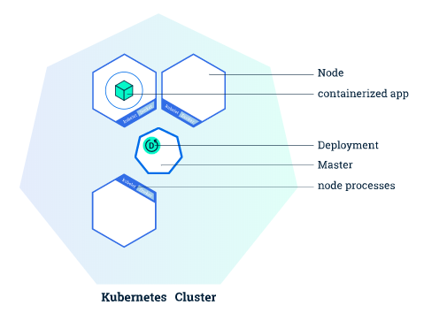
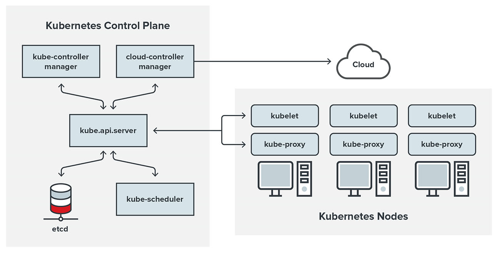

<style>
    table {
        border-collapse: collapse;
        width: 100%;
    }
    td, th {
        border: 1px solid #dddddd;
        padding: 8px;
    }
    th {
        text-align: center;
        background-color: #dddddd;
    }
    tr:nth-child(even) {
        background-color: #ffffff;
    }
    tr:nth-child(odd) {
        background-color: #efefef;
    }
</style>

## Introduction
Kubernetes (commonly abbreviated as k8s) is a **container orchestration** system that is designed to be easy to use and easy to deploy. As the "container orchestation" term suggests, Kubernetes relies on containers and offers an administration environment that focus on them. According to their docs:

> Kubernetes is a portable and extensible open source platform for managing workloads and services. Kubernetes facilitates automation and declarative configuration. It has a large and rapidly growing ecosystem. Support, tools and services for Kubernetes are widely available.

Summing up, kubernetes offers a fully equiped administration environment for running multiple containers, which makes it the favourite choice when it comes to deploying microservices inside a **cluster**.

### Clusters

A Cluster is a set of **nodes** that run containerized applications. Kubernetes clusters allow containers to run across multiple machines and environments: virtual, physical, cloud-based, and on-premises. Kubernetes containers are not restricted to a specific operating system, unlike virtual machines. Instead, they are able to share operating systems and run anywhere.



Clusters consists on a **master node** and a number of **worker nodes**. Nodes are independent machines with a number of cores and memory each which can run multiple containers. The master node controls the state of the cluster and is the origin of all task assignments, coordinating processses such as scheduling and scaling applications, maintaining the cluster state or implementeing updates.

Worker nodes, on the other hand, are the nodes that perform the master's assignments. They operate as part of one system, orchestated by the master. Worker noeds can be virtual or physical machines.

### Single Node Clusters

Single node clusters are a popular solution for testing and development purposes. Since they consists on a single node, they are able to run in local machines where developers can work on their applications' development.

Most used single node clusters are [Minikube](https://minikube.sigs.k8s.io/docs/start/) and [Docker Kubernetes](https://docs.docker.com/desktop/kubernetes/). The last one comes installed with Docker Desktop so you only need to activate kubernetes from the settings.

### Kubernetes Cluster Structure
A Kubernetes cluster contains six main components:

1. **API server:** Exposes a REST interface to all Kubernetes resources. Serves as the front end of the Kubernetes control plane.
2. **Scheduler:** Places containers according to resource requirements and metrics. Makes note of Pods with no assigned node, and selects nodes for them to run on.
3. **Controller manager:** Runs controller processes and reconciles the cluster’s actual state with its desired specifications. Manages controllers such as node controllers, endpoints controllers and replication controllers.
4. **Kubelet:** Ensures that containers are running in a Pod by interacting with the Docker engine , the default program for creating and managing containers. Takes a set of provided PodSpecs and ensures that their corresponding containers are fully operational.
5. **Kube-proxy:** Manages network connectivity and maintains network rules across nodes. Implements the Kubernetes Service concept across every node in a given cluster.
6. **Etcd:** Stores all cluster data. Consistent and highly available Kubernetes backing store. 



These six components can each run on Linux or as Docker containers (This is the case of Docker desktop kubernetes). The master node runs the **Control Plane** (API server, scheduler and controller manager), and the worker nodes run the kubelet and kube-proxy.

> kubernetes also provides an internal **DNS server** for registering services domain names, it is automatically included in the DNS requests made from the containers.

## CLI commands

> This section does not cover the complete Kubernetes CLI documentation. Think of it as a quick reference cheat sheet for basic commands when managing your cluster. You can find the complete documentation [here](https://kubernetes.io/docs/reference/generated/kubectl/kubectl-commands).

### Basic commands

- **Kubectl create**:

    Create a resource from a file or from stdin.

        $ kubectl create RESOURCE NAME [...PROPERTIES]

    >Check the [Resources](#resources) sections to see available resources

- **Kubectl get**
    
    Display one or many resources.

        $ kubectl get [(-o|--output=)json|yaml|name|go-template|go-template-file|template|templatefile|jsonpath|jsonpath-as-json|jsonpath-file|custom-columns-file|custom-columns|wide] (TYPE[.VERSION][.GROUP] [NAME | -l label] | TYPE[.VERSION][.GROUP]/NAME ...) [flags]
    

    | **Option**  	| **Shortcut** 	| **Description**                             	| **Exampe**                                 	|
    |-------------	|:------------:	|---------------------------------------------	|--------------------------------------------	|
    | --namespace 	|      -n      	| Specify the namespace to get resources from 	| ```Kubectl get pods --namespace=example``` 	|
    | --output    	|      -o      	| Output format                               	| ```Kubectl get deployments -o json```      	|
<br>

- **Kubectl describe**

    Show details of a specific resource. Print a detailed description of the selected resources, including related resources such as events or controllers. You may select a single object by name, all objects of that type, provide a name prefix, or label selector.

        $ kubectl describe RESOURCE NAME
    
    | **Option**  	| **Shortcut** 	| **Description**                             	| **Exampe**                                 	    |
    |-------------	|:------------:	|---------------------------------------------	|------------------------------------------------   |
    | --namespace 	|      -n      	| Specify the namespace to <br>get resources from 	| ```Kubectl describe pods --namespace=example``` 	|
<br>

- **Kubectl delete**

    Delete resources by file names, stdin, resources and names, or by resources and label selector.

        $ kubectl delete ([-f FILENAME] | [-k DIRECTORY] | TYPE [(NAME | -l label | --all)])

    | **Option**  	| **Shortcut** 	| **Description**                             	| **Exampe**                                 	    |
    |-------------	|:------------:	|---------------------------------------------	|------------------------------------------------   |
    | --namespace 	|      -n      	| Specify the namespace <br>to get resources from 	| ```Kubectl delete pods example --namespace=example``` 	|
    | --force    	|           	| Forces the deletion of the resource          	| ```Kubectl delete pods example --force``` 	|
    | --selector 	|      -l      	| Label query to filter on                  	| ```Kubectl delete pods --l key=value``` 	|
    
    > Deleting a namespace will also delete all objects in that namespace.


### App management

- **Kubectl apply**
    
    Apply a configuration to a resource by file (manifest) name or stdin. The resource name must be specified. This resource will be created if it doesn't exist yet.

        $ kubectl apply (-f FILENAME | -k DIRECTORY)

    > Check the [Manifests](#manifests) section to see the structure of the files.

- **Kubectl scale**

    Set a new size for a deployment, replica set, replication controller, or stateful set.

        $ kubectl scale [--resource-version=version] [--current-replicas=count] --replicas=COUNT (-f FILENAME | TYPE NAME)

### Working with apps

- **Kubectl exec**

    Execute a command in a container.

        $ kubectl exec (POD | TYPE/NAME) [-c CONTAINER] [flags] -- COMMAND [args...]
    
    | **Option**  	| **Shortcut** 	| **Description**                             	| **Exampe**                                 	    |
    |-------------	|:------------:	|---------------------------------------------	|------------------------------------------------   |
    | --container 	|      -c      	| Container name                             	| ```kubectl exec example -c cname -- echo "hi"``` 	|
    | --stdin    	|      -i    	| Pass stdin to the container                 	| ```Kubectl exec -i example -- echo "hi"```       	|
    | --tty        	|      -l      	| Stdin is a TTY                              	| ```Kubectl exec -t example -- echo "hi"``` 	|
    
    > Just like in docker, you can use -i & -t (-it) flags to launch an interactive shell inside the container.

- **Kubectl logs**

    Print the logs for a container in a pod or specified resource. If the pod has only one container, the container name is optional.

        $ kubectl logs [-f] [-p] (POD | TYPE/NAME) [-c CONTAINER]

    | **Option**  	| **Shortcut** 	| **Description**                             	| **Exampe**                                 	    |
    |-------------	|:------------:	|---------------------------------------------	|------------------------------------------------   |
    | --container 	|      -c      	| Prints a container log                        | ```kubectl logs example -c cname``` 	            |
    | --follow    	|      -f    	| Real time logs                             	| ```kubectl logs -f example ```       	            |
    | --tail        |            	| Print last X logs (default -1)               	| ```Kubectl logs --tail 100 example``` 	        |
    


## Resources

### Manifests

### Kubernetes API
 
### Project Contour

### Cert-Manager

## Conclusion
