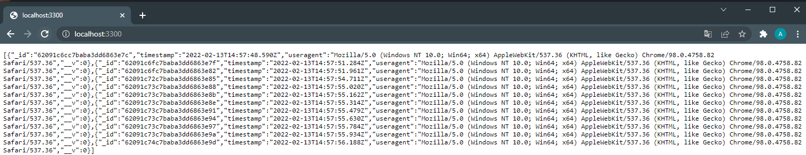

<style>
    summary {
        cursor: pointer;
    }
</style>

> **NOTE**: This guide will assume you have a basic understanding of Helm and Kubernetes and know how to run and manage a cluster. If you haven't already read my post about [Helm fundamentals](/helm-fundamentals), I encourage you to read it first.
>
> All the code in this guide is available on [GitHub](https://github.com/alesancor1/Blog-Projects/tree/main/guides/simple-app-helm)

## Introduction

For this guide, we will be deploying the simple NodeJS we build in a previous post, feel free to go [check it out](/create-simple-app) first. We will go through all the steps to set up our simple NodeJS app inside a Kubernetes cluster.

> This guide is parallel to the [Deploying a simple NodeJS App in kubernetes](/simple-app-kubernetes) guide, so you can open both posts and compare them, since both posts will follow the same exact structure.

Unlike kubernetes, before starting to write manifests file like crazy, we first need to create our Helm chart with `helm create` command as explained in the **Helm fundamentals** post. Once created, we can start templating and installing dependencies in our chart.

## Creating the Database manifests
For the database we will not template the k8s manifests, since there are already created charts in [Artifact Hub](https://artifacthub.io/). We will use the **mongodb chart** from there and configure our `values.yaml` file to adapt it to our needs.


This way, our `Chart.yaml` file will contain the following under the `dependencies` field:

```yaml	
...
dependencies:
  - name: mongodb
    version: "*"
    repository: "https://charts.bitnami.com/bitnami"
    alias: simple-db
```

Values will contain the **fields overrides** for the *name*, *namespace* and *auth* values (our app connects to a MongoDB without authentication, so we need to disable it).

<details>
<summary> <b>Show values</b> </summary><div style="margin-left:20px">

```yaml
# Values.yaml
...
# DB Configs
simple-db:
  fullnameOverride: simple-db
  nameOverride: simple-db
  auth:
    enabled: false

global:
  namespaceOverride: simple-app
```
</div></details>

> Note we are naming the release *simple-db* through the `alias` field in dependencies, this let us override the chart values using that key inside `values.yaml`. You can check the docs for the MongoDB chart [here](https://artifacthub.io/packages/helm/bitnami/mongodb).

## Creating the App manifests
Now we have to create our app's **manifest files**, just like we would normally do in kubernetes. However, this time we will use **Helm templates** along the `values.yaml` file to generate them.
### Service
Since we want our app to be deployed in both **production** and **development** environments, we usually would need to create to separate manifests for the service. Helm solves that issue thanks to the **templating system**, so we can conditionally add fields to our manifest depending on a value in the `values.yaml` file.

We will use the `node_env` value to create the manifest for a production or a development environment:

<details>
<summary> <b>Show template</b> </summary><div style="margin-left:20px">

```yaml
apiVersion: v1
kind: Service
metadata:
  labels:
    app: {{ .Chart.Name }}
  name: {{ .Chart.Name }}
  namespace: simple-app
spec:
  {{- if eq .Values.node_env "development" }}
  type: NodePort
  {{- end }}
  ports:
    - name: {{ .Chart.Name }}
      port: {{ .Values.port }}
      protocol: TCP
      targetPort: {{ .Values.port }}
      {{- if eq .Values.node_env "development" }}
      nodePort: {{ .Values.port }}
      {{- end }}
  selector:
    app: {{ .Chart.Name }}
```
</div></details>

> When templating, you can run the `helm install` command with the `--dry-run` flag to **simulate** the installation and print the resulting manifests that will be applied. Don't forget to run `helm dep up` if your chart has any dependencies

### Deployment
Just like we have done for the service, we will now create the deployment template. We will use the **Values** object to get the values and assign them to our container's environment variables so we can make our app as configurable as possible.

<details>
<summary> <b>Show template</b> </summary><div style="margin-left:20px">

```yaml
apiVersion: apps/v1
kind: Deployment
metadata:
  labels:
    app: {{ .Chart.Name }}
  name: {{ .Chart.Name }}
  namespace: simple-app
spec:
  replicas: 1
  selector:
    matchLabels:
      app: {{ .Chart.Name }}
  template:
    metadata:
      labels:
        app: {{ .Chart.Name }}
    spec:
      containers:
        - env:
          - name: PORT
            value: "{{ .Values.port }}"
          - name: DB_HOST
            value: {{ .Values.db_host }}
          - name: DB_PORT
            value: "{{ .Values.db_port }}"
          - name: DB_NAME
            value: {{ .Values.db_name }}

          image: alesancor1/simple-app:{{ .Chart.AppVersion }}
          imagePullPolicy: Always
          name: {{ .Chart.Name }}
          ports:
            - containerPort: {{ .Values.port }}
              protocol: TCP
          resources:
            requests:
              memory: 300Mi
            limits:
              memory: 500Mi
```
</div></details>

We are using the *port*, *db_host*, *db_port*, *db_name* values from the `values.yaml` file to configure our container's environment variables, so we need to provide some default values for them:

<details>
<summary> <b>Show values</b> </summary><div style="margin-left:20px">

```yaml
# Values.yaml

# App Configs
node_env: development
db_host: simple-db
db_port: 27017
db_name: simple-db
port: 3300
...
```
</div></details>

> We are setting those values by **default**, they can be **overriden** when installing the chart through the `-f <file>` or the `--set` flags of the `helm install` command.

## Running locally on a single node cluster
In order to run in a local development environment, we just need to run the **helm install** command. We can override the default values with a new **yaml** file or directly through the **command line**. Since by default it will install for a **development** environment, tthere's no real need to override values, so we can directly run helm install on our chart. Remember to create the namespace before installing it:

```bash
$   kubectl create ns simple-app
$   helm install simple-app .
```

If you performed all the steps correctly (remember to run only local services manifests), you should be able to see the app running on http://localhost:3300.



## Production environments: DNS and TLS configuration
For production environments, we will configure a **DNS record** pointing to the service. We will also configure a TLS certificate and a certificate signing request. For doing that, we will use **Project Contour** and **Cert-Manager** APIs, which simplifies the process. Since they are not native, first thing we need to do is installing them by running:

```bash
$    kubectl apply -f https://projectcontour.io/quickstart/contour.yaml
$    kubectl apply -f https://github.com/jetstack/cert-manager/releases/download/v1.1.0/cert-manager.yaml
```

> **Project Contour** provide a Load Balancer service that will be our reverse proxy. Be sure to obtain its **external IP** and configure an **A record** in your **NS zone** pointing to that IP. The External IP can be obtained running `kubectl get -n projectcontour service envoy` (it takes a while to be ready).
>
> Be sure to set the `node_env` value to `production` when installing the chart.

### Issuer and ClusterIssuer
Before validating TLS certificates, we need to create an Issuer resource that will perform that task and generate the secrets for the certificates. We can create an **Issuer** or a **ClusterIssuer** resource just like we would in Kubernetes. This resource is pretty much the same for kubernetes and Helm, so we will just use the Chart Name for templating.

<details>
<summary> <b>Show Template</b> </summary><div style="margin-left:20px">

```yaml
{{- if eq .Values.node_env "production" }}
apiVersion: cert-manager.io/v1
kind: Issuer
metadata:
  name: {{ .Chart.Name }}-letsencrypt
  namespace: simple-app
spec:
  acme:
    privateKeySecretRef:
      name: {{ .Chart.Name }}-letsencrypt
    server: https://acme-v02.api.letsencrypt.org/directory
    solvers:
    - http01:
        ingress:
          class: contour
{{- end }}
```
</div></details>

> This issuer is the same we are using in the **Kubernetes post**, note that we have added the conditional clause wrapping the whole template. Thus, when the condition isn't met **the manifest is blank and Helm will ignore it**.
### TLS certificates
Certificates will be issued by the **Issuer** and stored in a secret consumed by the **HTTPProxy** resource. For this example, we are specifying only one DNS Name, but thanks to Helm we could define an array and dynamically generate the manifest for each one of them.

<details>
<summary> <b>Show Template</b> </summary><div style="margin-left:20px">

```yaml
{{- if eq .Values.node_env "production" }}
apiVersion: cert-manager.io/v1
kind: Certificate
metadata:
  name: {{ .Chart.Name }}-certs
  namespace: simple-app
spec:
  dnsNames:
    - {{ .Values.domain }}
  issuerRef:
    name: {{ .Chart.Name }}-letsencrypt
    kind: Issuer
  secretName: {{ .Chart.Name }}-certs
{{- end }}
```
</div></details>

> **NOTE:** Certificates take a while to be issued, it is possible that **HTTPProxy** is created before the certificate is ready. This will cause the **HTTPProxy** service to fail. Check the status of the certs by running `kubectl describe Certificate <cert-resource-name>` and restart the HTTPProxy when they are ready.

### Httpproxy
Finally, we will create the **HTTPProxy** resource that will redirect to the corresponding pods depending on the specified **fqdn**. We template it so the `tls.secretName` and the `services` match their corresponding resource names.

<details>
<summary> <b>Show Template</b> </summary><div style="margin-left:20px">

```yaml
{{- if eq .Values.node_env "production" }}
apiVersion: projectcontour.io/v1
kind: HTTPProxy
metadata:
  name: {{ .Chart.Name }}-httpproxy
  namespace: simple-app
spec:
  virtualhost:
    fqdn: {{ .Values.domain }}
    tls:
      secretName: {{ .Chart.Name }}-certs
  routes:
  - services:
    - name: {{ .Chart.Name }}
      port: {{ .Values.port }}
    loadBalancerPolicy:
      strategy: Cookie
{{- end}}
```
</div></details>


## Conclusions
If you have been comparing this post with the [Kubernetes guide](/simple-app-kubernetes) you should have noticed that templating the resources is way easier since Helm does a great part of the job for us. Templates and dependencies are one of the biggest strengths of Helm, and makes of it a great tool for deploying complex applications. 

Besides all that have been shown in this guide, charts can be uploaded to the Artifact Hub using GitHub Pages and creating an account (a future post will cover this), and many other features of Helm remain to be discovered. So, if you already knew kubernetes and want to take a step further, Helm is the way to go.