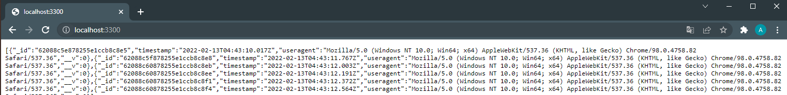

<style>
    summary {
        cursor: pointer;
    }
</style>

> **NOTE**: This guide will assume you have a basic understanding of Kubernetes and know how to run and manage a cluster. If you haven't already read my post about [Kubernetes fundamentals](/kubernetes-fundamentals), I encourage you to read it first.
>
> All the code in this guide is available on [GitHub](https://github.com/alesancor1/Blog-Projects/tree/main/guides/simple-app-kubernetes)

## Introduction

For this guide, we will be deploying the simple NodeJS we build in a previous post, feel free to go [check it out](/create-simple-app) first. We will go through all the steps to set up our simple NodeJS app inside a Kubernetes cluster.

> This guide is parallel to the [Creating a Helm Chart for a simple NodeJS App](/simple-app-helm) guide, so you can open both posts and compare them, since both posts will follow the same exact structure.

## Creating the Database manifests
We will first write the database manifests files, starting by the service and then the pvc and finally the deployment. This order will be the same for the creation of the resources, since deployment depends on the pvc and the service needs to exist in order for the pods to be exposed by it.

### Service
Since we are deploying a MongoDB, we will set the service to use the default MongoDB port: `27017`. This way, our manifest will have the same port and target port:

<details>
<summary> <b>Show Manifest</b> </summary><div style="margin-left:20px">

```yaml
# svc.yaml
apiVersion: v1
kind: Service
metadata:
  labels:
    app: simple-db
  name: simple-db
  namespace: simple-app
spec:
  ports:
    - name: '27017'
      port: 27017
      protocol: TCP
      targetPort: 27017
  selector:
    app: simple-db
```
</div></details>

> This service will not be exposed to the outside world, all database connections will be managed internally through the **kubernetes built-in DNS**.

### Persistent Volume Claim
For persistence, we will declare a **PVC** that claims a volume with 20Gi storage and *ReadWriteOnce* access mode:

<details>
<summary> <b>Show Manifest</b> </summary><div style="margin-left:20px">

```yaml
# pvc.yaml
kind: PersistentVolumeClaim
apiVersion: v1
metadata:
  name: simple-db
  namespace: simple-app
  labels:
    app: simple-db
spec:
  accessModes:
    - ReadWriteOnce
  resources:
    requests:
      storage: 20Gi
```
</div></details>

> We will not create a persistent volume that matches this PVC, as mentioned in the **Kubernetes Fundamentals** post, we are letting de cluster **dynamically provision** the volume for us.

### Deployment
Once the service and PVC are created, we will now write the deployment manifest. The deployment will have the label `app` to be matched by the service **selector**, and will mount a volume to the `/data/db` container directory. This volume will reference our **PVC**:

<details>
<summary> <b>Show Manifest</b> </summary><div style="margin-left:20px">

```yaml
# deployment.yaml
apiVersion: apps/v1
kind: Deployment
metadata:
  labels:
    app: simple-db
  name: simple-db
  namespace: simple-app
spec:
  replicas: 1
  selector:
    matchLabels:
      app: simple-db
  template:
    metadata:
      labels:
        app: simple-db
    spec:
      containers:
        - image: mongo
          imagePullPolicy: Always
          name: simple-db
          ports:
            - containerPort: 27017
              protocol: TCP
          volumeMounts:
            - mountPath: /data/db
              name: volume-simple-db-data
      volumes:
        - name: volume-simple-db-data
          persistentVolumeClaim:
            claimName: simple-db
```
</div></details>


## Creating the App manifests

### Service
The deployment will be made for both **local** and **production** environments, so we will need to write a service that binds the ports of the cluster to our **local machine** ports.

Starting with the local service, we define it as a NodePort, which port and nodePort will be the same in which the app is running inside the container: `3300`.

> **NOTE**: Since the port `3300` is not inside the default **NodePort range**, we will need to add the `--node-port-range` flag to the kubeapi-server.yml file. As described in the **Kubernetes Fundamentals** post.

<details>
<summary> <b>Show Manifest</b> </summary><div style="margin-left:20px">

```yaml
# svc-local.yaml
apiVersion: v1
kind: Service
metadata:
  labels:
    app: simple-app
  name: simple-app
  namespace: simple-app
spec:
  type: NodePort
  ports:
    - name: simple-app
      port: 3300
      protocol: TCP
      targetPort: 3300
      nodePort: 3300
  selector:
    app: simple-app
```
</div></details>

On the other hand, the production service will be set as **ClusterIP** (default) and exposed internally at port `3300` too:

<details>
<summary> <b>Show Manifest</b> </summary><div style="margin-left:20px">

```yaml
# svc.yaml
apiVersion: v1
kind: Service
metadata:
  labels:
    app: simple-app
  name: simple-app
  namespace: simple-app
spec:
  ports:
    - name: simple-app
      port: 3300
      protocol: TCP
      targetPort: 3300
  selector:
    app: simple-app
```
</div></details>

> The service port can actually be any, we will be using the same port for both environments.

### Deployment
Our app will run on the port `3300` of the container. For that, we need to specify that port under the `containerPort` field, apart from passing the `PORT` environment variable to the container. We also have to make sure the labels specified in metadata are the same as the service selector.

<details>
<summary> <b>Show Manifest</b> </summary><div style="margin-left:20px">

```yaml
# deployment.yaml
apiVersion: apps/v1
kind: Deployment
metadata:
  labels:
    app: simple-app
  name: simple-app
  namespace: simple-app
spec:
  replicas: 1
  selector:
    matchLabels:
      app: simple-app
  template:
    metadata:
      labels:
        app: simple-app
    spec:
      containers:
        - env:
          - name: PORT
            value: "3300"
          - name: DB_HOST
            value: simple-db
          - name: DB_PORT
            value: "27017"
          - name: DB_NAME
            value: simple-db

          image: alesancor1/simple-app:latest
          imagePullPolicy: Always
          name: simple-app
          ports:
            - containerPort: 3300
              protocol: TCP
          resources:
            requests:
              memory: 300Mi
            limits:
              memory: 500Mi
```
</div></details>

> Note that the `DB_HOST` env variable is set the same as the name of the MongoDB service. This is because the cluster automatically provides service discovery through its **internal DNS**.

## Running locally on a single node cluster
With all the manifests files created, we can now deploy the app to the cluster. We will start a single node cluster (**Minikube** or **Docker k8s**) and apply the manifests in the same order as this guide does. For that, use the `-f` flag to specify the manifests files to be applied. Don't forget to create the namespace before applying the manifests.

    $ kubectl create namespace simple-app
    $ kubectl apply -f <file>

If you performed all the steps correctly (remember to run only local services manifests), you should be able to see the app running on http://localhost:3300.



## Production environments: DNS and TLS configuration
For production environments, we will configure a DNS record pointing to the service. We will also configure a TLS certificate and a certificate signing request. For doing that, we will use **Project Contour** and **Cert-Manager** APIs, which simplifies the process. Since they are not native, first thing we need to do is installing them by running:

```bash
$    kubectl apply -f https://projectcontour.io/quickstart/contour.yaml
$    kubectl apply -f https://github.com/jetstack/cert-manager/releases/download/v1.1.0/cert-manager.yaml
```

> **Project Contour** provide a Load Balancer service that will be our reverse proxy. Be sure to obtain its **external IP** and configure an **A record** in your **NS server** pointing to that IP. The External IP can be obtained running `kubectl get -n projectcontour service envoy` (it takes a while to be ready).
>
> Be sure to apply the local services manifests when deploying to production

### Issuer and ClusterIssuer
Before validating TLS certificates, we need to create an Issuer resource that will perform that task and generate the secrets for the certificates. We can create an **Issuer** or a **ClusterIssuer** resource. They are the same, except that the **ClusterIssuer** is not namespace and thus can be used in any namespace. We will use an **Issuer** resource under our `simple-app` namespace.

<details>
<summary> <b>Show Manifest</b> </summary><div style="margin-left:20px">

```yaml
apiVersion: cert-manager.io/v1
kind: Issuer
metadata:
  name: simple-app-letsencrypt
  namespace: simple-app
spec:
  acme:
    privateKeySecretRef:
      name: simple-app-letsencrypt
    server: https://acme-v02.api.letsencrypt.org/directory
    solvers:
    - http01:
        ingress:
          class: contour
```
</div></details>

> This issuer uses the **Let's Encrypt** ACME server, there are ways to provide locally stored certs, check the [official documentation](https://cert-manager.io/docs/concepts/issuer/) for more information.

### TLS certificates
For TLS certificates, we will use the `cert-manager` API. We will create a certificate object which will be issued by an Issuer. The validation process (Letsencrypt Challenge) will generate a secret that will be used by **Httpproxy** to redirect the trafic over TLS.

<details>
<summary> <b>Show Manifest</b> </summary><div style="margin-left:20px">

```yaml
apiVersion: cert-manager.io/v1
kind: Certificate
metadata:
  name: simple-app-certs
  namespace: simple-app
spec:
  dnsNames:
    - simple-app.example.com
  issuerRef:
    name: simple-app-letsencrypt
    kind: Issuer
  secretName: simple-app-certs
```
</div></details>

> **NOTE**: You may need to restart Httproxy after validating certificates if you issued the certifiactes after creating the Httpproxy.

### Httpproxy
Once project contour is ready, we can create a HTTP proxy service that will be used to redirect all traffic to the project contour service using our previously configured DNS record.

<details>
<summary> <b>Show Manifest</b> </summary><div style="margin-left:20px">

```yaml
apiVersion: projectcontour.io/v1
kind: HTTPProxy
metadata:
  name: simple-app-httpproxy
  namespace: simple-app
spec:
  virtualhost:
    fqdn: simple-app.example.com
    tls:
      secretName: simple-app-certs
  routes:
  - services:
    - name: simple-app
      port: 3300
    loadBalancerPolicy:
      strategy: Cookie
```
</div></details>

> Note our simple-app is never running on port '80' as it is typical from web applications. We should avoid deploying our apps to container ports under 1024 since they would run as **privileged** user, causing a potential security issue.

## Conclusions
As you may have noticed, deploying an application to production is a bit more harder than doing it locally. Certificates and DNS makes the process a little more complicated, but luckily we count with the help of **Project Contour** and **Cert-Manager**. Still, the process is not so straight forward and depends a lot on configuration and knowledge of the underlying technologies, such as DNS records and networking.